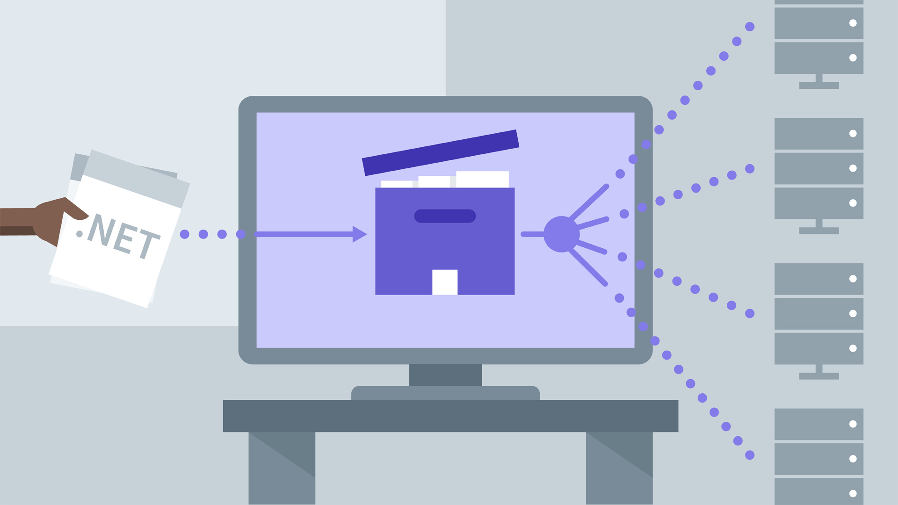

项目部署要先建立好数据库、前端打包、后端打包、上传部署到服务器:

1. 初始化数据库：

   1. 创建数据库：

      ```sql
      CREATE DATABASE ebag DEFAULT CHARACTER SET utf8mb4 COLLATE utf8mb4_unicode_ci;
      ```

   2. 进入目录: `cd ${new-ebag-web}/ebag-web-app/sql`

   3. 执行脚本 `db-init` 导入 SQL 文件创建表：

      * Linux：`sh db-init.sh root root ebag`
      * Windows：`db-init.bat root root ebag`

2. 前端打包：

   1. 进入目录: `cd ${new-ebag-web}/ebag-vue-app`
   2. 执行打包:
      * Linux: `sh build.sh`
      * Windows: `build.bat`
   3. 打包结果: 页面会生成到 `ebag-web-app` 下的 page 和 static 目录

3. 后端打包，并自动部署到服务器：
   1. 进入目录: `cd ${new-ebag-web}/ebag-web-app`
   2. 打包部署: `gradle clean deploy -Denv=production` (-Denv 选择打包的环境或者学校)

4. 部署 IM Server

   1. 进入目录: `cd ${new-ebag-web}/ebag-im-server`
   2. 打包部署: `gradle clean deploy -Denv=test`
   3. 监听端口是 3721，可以使用 `jps -l` 查看是否启动

## 打包说明

前端构打包要执行一下几步:

1. 删除 WEB-INF/page 目录
2. 删除 WEB-INF/static 目录
3. 执行 npm run build

前端打包的命令已经写成了脚本 build.js 和 build.bat。

没有把前端和后端打包命令放在一个脚本里，是因为前端打包一次可以给多个不同的服务器端部署环境使用 (只是数据库用户名密码、连接信息等不同，前端不涉及这些配置)，可以避免重复打包前端。

## 项目部署



如果不使用脚本进行自动化部署，项目打包部署一般按照以下几个步骤进行：

1. 选择正确的环境打包: 测试环境、线上环境等
2. 把 war 包上传到服务器（使用 FTP、scp 等）
3. 停止 tomcat: `${tomcat}/bin/shutdown.sh`
4. 删除服务器上的项目文件: `rm -rf ${project_path}`
5. 解压 war 包到项目路径下: `unzip project.war -d ${project_path}`
6. 启动 tomcat: `${tomcat}/bin/startup.sh`
7. 删除上传的 war 包
8. 如果有 N 个服务器，就需要重复 2 到 7 共 N 次

每次部署都要重复这么多步骤，效率不高，而且容易疏忽出错，为了解决这些问题，在我们的项目中直接执行 Gradle 的 **deploy** 任务就可以自动完成上面这些步骤，极大的提高了效率:

1. 进入项目目录: 例如 `cd /Users/Biao/Documents/workspace/new-ebag-web`
2. 执行部署命令: 
   * 部署到测试环境: `gradle clean deploy -Denv=test`
   * 部署到线上环境: `gradle clean deploy -Denv=production`

> 需要其他环境，在 **config.groovy** 中配置对应的环境参数即可，目前只配置了开发环境和线上环境。服务器的访问信息修改 deploy 中的 hostname, username, password。
>
> 想要了解 deploy 更多的详细信息请参考 [Gradle Deploy](http://qtdebug.com/gradle-deploy/)。

