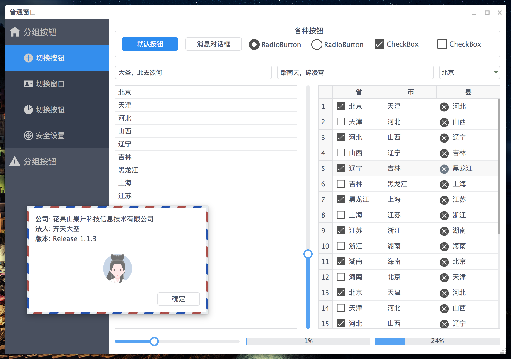

编译后把源码 bin 目录下的所有文件复制到编译出来的可执行文件所在目录，然后运行，界面效果为



> 请注意查看代码中标记为 `CentralWidget 中 TODO` 的地方

## 侧边栏按钮

有 2 种按钮(为了更好的 QSS 效果，代码中会把 QPushButton 的 flat 属性设置为 true):

* 分组按钮: class 为 GroupButton
* 组内按钮: class 为 GroupItemButton

每个按钮都有以下属性:

* `class`: GroupButton or GroupItemButton

* `action`: popup or empty

  * popup 指点击后弹出对话框

  * 空的时候可以不增加这个属性

  * 空则点击后对应 widget 显示到中间区域的 Content Stacked Widget

    > 这些按钮会被自动的添加到一个 QButtonGroup，为了保证同时只有一个被选中

* `groupName`: 同一组的按钮的 groupName 都一样，为了同时显示和隐藏他们(只有 class 为 GroupItemButton 的按钮需要隐藏和显示)

在 Ui Designer 中打开 `gui/CentralWidget.ui` 编辑侧边栏按钮，增加按钮的时候务必按照上面的规则给按钮增加相遇的属性。

## 主要内容区: ContentStackedWidget

使用 QStackedWidget 动态的显示 widget，这样点击左边的侧边栏中的按钮后，在它里面显示对应的 widget

## 自定义无边框窗口

TopWindow 为自定义无边框窗口，可以创建普通窗口，也可以创建模态窗口，参考下面的使用

```cpp
// 主窗口
CentralWidget *centralWidget = new CentralWidget();

// [1] 使用自定义窗口显示主窗口: 普通窗口，显示最大最小和关闭按钮，可调整窗口大小
TopWindow window(centralWidget);
window.setTitle("普通窗口");
window.resize(1000, 700);
window.show();

// [2] 点击按钮弹出阻塞模态对话框，在任务栏不显示图标
connect(ui->modalDialogButton, &QPushButton::clicked, [] {
    DemoWidget *c = new DemoWidget();
    TopWindow window(c);
    window.showModal();

    // 直到关闭 window，程序才继续往下运行
    qDebug() << c->getStatus();
});

// [3] 弹出消息对话框
TopWindow::message("花果山果汁科技信息技术有限公司\n法人是齐天大圣");
TopWindow::message("<b>公司</b>: 花果山果汁科技信息技术有限公司<br>"
                   "<b>法人</b>: 齐天大圣<br>"
                   "<b>版本</b>: Release 1.1.3<br>"
                   "<center></center>", 350, 140);
```

## 修改 QSS 样式

QSS 文件位于 `resources/qss` 文件夹下，例如修改侧边栏的按钮的图标，修改 sidebar.qss 中对应按钮的图片即可(使用 objectName 进行选择)。

可以增加新的 QSS 文件，添加到 `data/config.json` 中的 `qss_files` 数组中即可。

QSS 文件修改后，按下 `Ctrl + L` 即可自动加载就能看到效果，不需要重启程序。

## 日志工具

增加了日志框架，`qDebug()` 输出的内容会自动记录到 exe 所在目录的 log 目录下，每天生成一个日志文件。